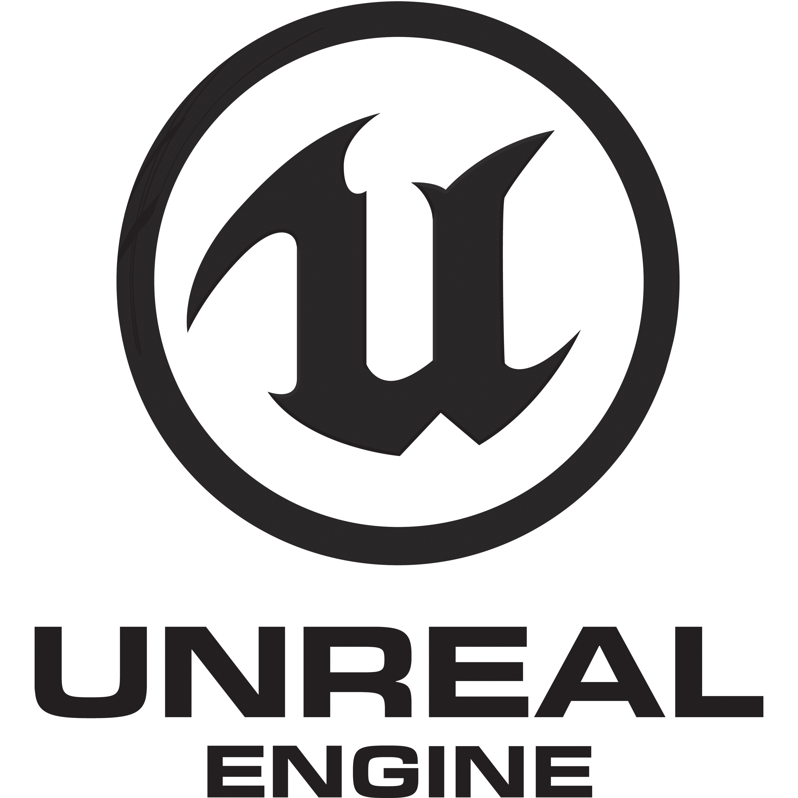
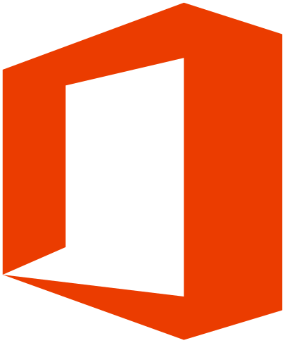

# Sze Hiu Yeung

**`Digital Media student (Game Programmer)`**

A motivated game design student seeking a challenging opportunity to apply my programming skills and passion for game development to create innovative and engaging gaming experiences. 

### 🧰 Skills

 

#

### 📺 Tools

 

#

### 📺 Tools
<!-- Project Cards Section -->

<!-- Project 1 -->

